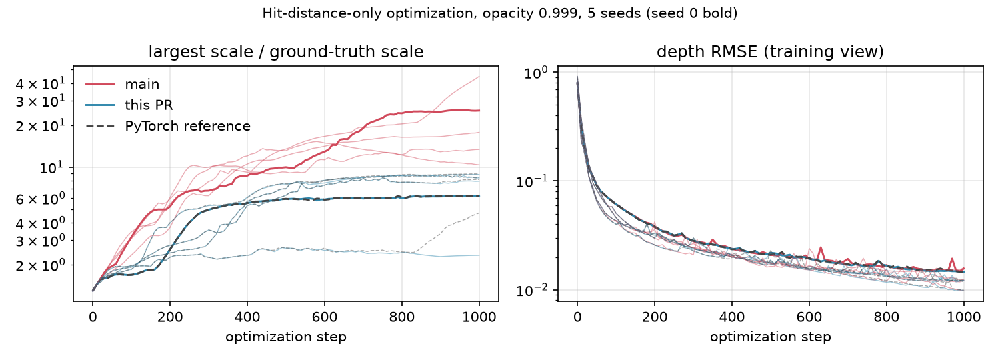
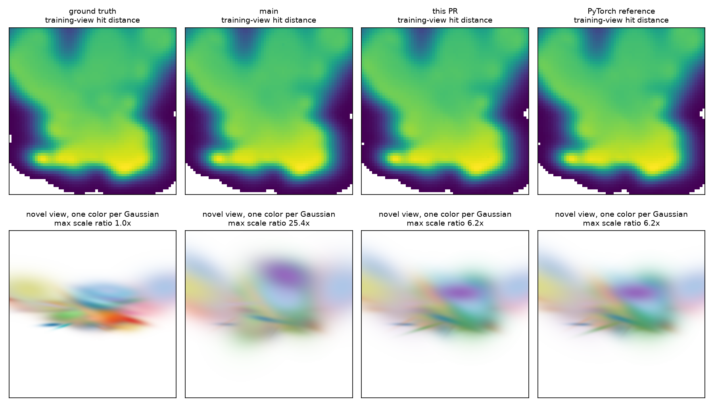

# eval3d hit-distance gradient at clamped alpha: measured results

Fixes the gradient part of [issue #978](https://github.com/nerfstudio-project/gsplat/issues/978): at fragments where the forward pass clamps alpha to `MAX_ALPHA`, the backward pass dropped the hit-distance gradient to means/quats/rays (and part of it to scales) and the rendered-normal gradient to quats.

Before: upstream `512d366b67073d77ca099ede742683c165dfc23b`.
After: fix `dca568966335f5152fa369cbe75e834ce059755d`.





## What is measured

`exp.py` runs once per build. Scene: 48 surfel-like Gaussians on a tilted surface, 64×64 pinhole, `use_hit_distance=True`. The PyTorch reference (`gsplat/cuda/_torch_impl_eval3d.py`, autograd) is the oracle; it does not depend on the native kernel.

1. **Gradient error** (`results/grad_error.json`): relative error of the CUDA gradient of a weighted sum of the hit-distance channel vs. the reference, for opacity 0.5 to 0.999. "Clamped fragments" counts (Gaussian, pixel) pairs with `opacity × response ≥ MAX_ALPHA` among fragments with alpha ≥ 1/255, inside the reference.
2. **Optimization** (`results/{main,fix}_s*.json`, `summary.json`): from perturbed means/rotations and 1.3× scales, 1000 Adam steps (lr 0.01) on MSE of the hit-distance channel, opacity fixed at 0.999, optimizing means, quats and log-scales. The after build also runs the same optimization with the reference backend. Recorded every 10 steps: depth RMSE in the training view, mean position error, mean and max of scale / ground-truth scale. Final parameters are in `*_params.pt`, final depth maps in `*.npz`.

`plot.py` makes the figures and `summary.json` (mean, min, max over seeds). The novel view in `renders.png` is rendered with the standard `rasterization()`, forward only, one color per Gaussian.

Note: with a hit-distance-only loss, scale is weakly constrained, so the reference also grows scales; compare `main` against the reference, not against ground truth. In seed 3 the fixed build and the reference diverge late (largest scale 2.3× vs 4.7×) as float32 differences accumulate; their mean scale ratios agree within 0.03.

## Reproduce

```bash
git -C /path/to/gsplat archive 512d366 gsplat | tar -x -C src-main
git -C /path/to/gsplat archive dca5689 gsplat | tar -x -C src-fix
# copy gsplat/cuda/csrc/third_party/glm (submodule) into both trees
export NUM_CHANNELS=3 BUILD_CAMERA_WRAPPERS=0
for s in 0 1 2 3 4; do
  SEED=$s TORCH_EXTENSIONS_DIR=ext-main PYTHONPATH=src-main python exp.py main out noref 0.999 1000
  SEED=$s TORCH_EXTENSIONS_DIR=ext-fix  PYTHONPATH=src-fix  python exp.py fix  out ref   0.999 1000
done
TORCH_EXTENSIONS_DIR=ext-fix PYTHONPATH=src-fix python plot.py out
```

`results/` here is that `out` directory (`plot.py` writes the PNGs and `summary.json` next to the results). The reference needs `nerfacc`. Measured on B200, PyTorch 2.11.0+cu128 / CUDA 12.8; see `provenance.json`.
