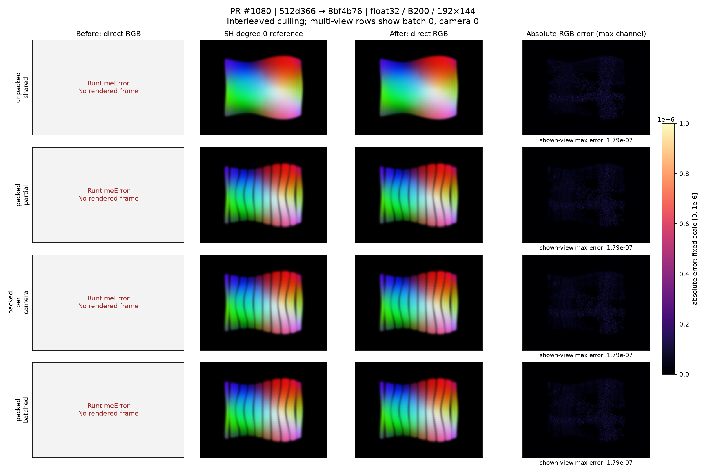
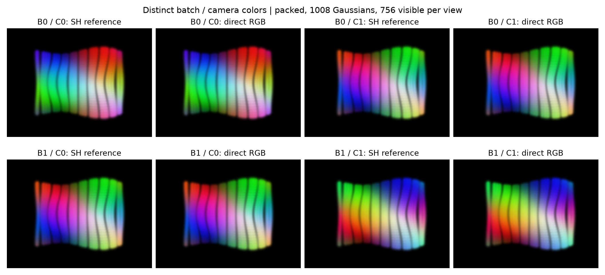

# PR #1080: measured 2DGS direct-color comparisons

[Fixes #765](https://github.com/nerfstudio-project/gsplat/issues/765) through [PR #1080](https://github.com/nerfstudio-project/gsplat/pull/1080).

Before: upstream `512d366b67073d77ca099ede742683c165dfc23b`.
After: color fix `8bf4b762c1db0ec555d76df398a34ff89b9b9e68`.
These runs do not include the empty-scene changes from #1079.





## Method

The deterministic scene has 1,008 Gaussians, float32 inputs, 192×144 pixels and focal length 150. Partial clipping puts IDs `1,5,9,...` behind the camera, leaving 756 per view. Every retained Gaussian is visible in both cameras. Batch and camera palettes differ by cyclic RGB-channel permutations. No background argument is supplied.

Each reference independently renders one batch and one camera through the non-packed SH degree 0 path, using `SH0 = (RGB - 0.5) / 0.28209479177387814`. RGB values are strictly inside (0,1). The script compares all batch/camera outputs, not just the views shown in the first figure. SH forward outputs are bitwise identical before and after.

Before-fix direct RGB raises `RuntimeError` in all five cases. Those failures produce **no rendered frame**; gray panels are error annotations, not synthetic baseline renders. The actual exception text is preserved in the `before-*.json` files. The NPZ files for those runs contain SH references only.

Forward comparisons use `RGB+ED` with distortion enabled and cover RGB, alpha, expected depth, rendered normals, distortion and median. Backward comparisons use a separate RGB-only render with distortion disabled and the loss `mean(RGB * linspace(0.5, 1.5, RGB.numel()).reshape_as(RGB))`. SH conversion remains differentiable with respect to the original RGB leaf tensors. All checked outputs and gradients are finite; shapes/dtype/device are recorded in JSON or the raw arrays. Comparisons use `rtol=1e-4, atol=1e-5`.

The CSV/JSON errors are absolute maxima over all pixels/views or all gradient elements. Across nonempty visible cases, RGB maximum error is `1.7881393432617188e-7`, color-gradient maximum error is `8.731149137020111e-11`, and opacity-gradient maximum error is `5.820766091346741e-11`. Alpha, expected depth and the three auxiliary outputs match exactly. Culled-color gradients are zero. With `N=1008, nnz=0`, all outputs and compared gradients are zero. Raw gradients, including geometry, are stored alongside the images in NPZ.

Unbatched runs compare all geometry, pose, opacity and color gradients against the independent reference; the largest absolute error is `8.940696716308594e-8` (view matrices). The batched case compares **color and opacity gradients only** against this reference: upstream has a separate cross-batch geometry-backward discrepancy. The PR tests separately compare batched geometry gradients against batched SH with a common palette. This evidence makes no claim to fix that discrepancy. Depth backward and multi-camera non-packed opacity handling are outside this fix.

## Reproduce

Requirements: CUDA GPU, PyTorch, the corresponding gsplat checkout, NumPy and matplotlib. Render once in each checkout; use one common output directory. Set the desired CUDA build flags and use the repository's normal build process. The published native hashes and flags are in [provenance.json](provenance.json). An optional `--extension /path/to/gsplat_cuda.so` selects a previously built native extension instead of JIT. Native binaries are not uploaded.

```bash
# Run from the BEFORE checkout, with the asset script outside that checkout.
PYTHONPATH="$PWD" python /path/to/pr-1080/render_comparison.py --version before --output /path/to/results

# Run from the AFTER checkout, writing into the same results directory.
PYTHONPATH="$PWD" python /path/to/pr-1080/render_comparison.py --version after --output /path/to/results

# Either checkout; no rendering is performed by --summarize.
python /path/to/pr-1080/render_comparison.py --summarize --output /path/to/results
```

Each case runs in a subprocess with a 120-second timeout. Unexpected after-fix errors, non-finite values and failed numerical comparisons terminate the script. CUDA atomic reductions can cause small backward differences between reruns.

## Files

- `render_comparison.py`: scene, rendering, comparisons and plotting.
- `provenance.json`: source commits, environment, build flags and native hashes.
- `results/metrics.json` and `metrics.csv`: measured forward and gradient errors.
- `results/{before,after}-*.json`: actual status, settings and exceptions.
- `results/{before,after}-*.npz`: rendered/reference arrays and RGB-loss input gradients. `image[..., :3]` is RGB and `image[..., 3:]` is expected depth.
- `results/*.png`: the two figures embedded in the PR body. RGB display range is [0,1]; the first figure's absolute-error scale is fixed at [0,1e-6].

The assets live only on `pr_asset`; the code PR contains `Rendering.cpp` and the existing `tests/test_2dgs.py` only.
