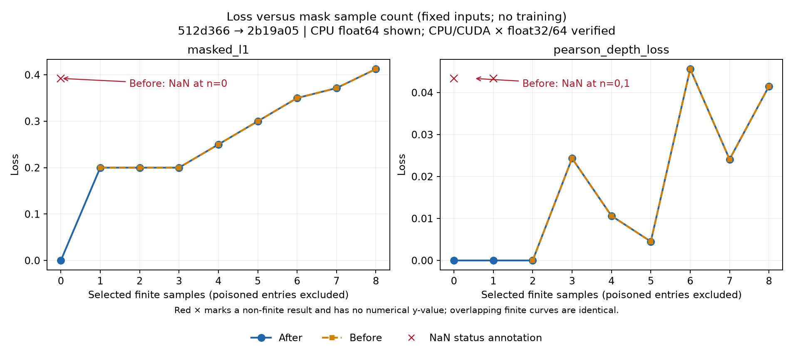

# PR #1082: measured loss curves

[PR #1082](https://github.com/nerfstudio-project/gsplat/pull/1082) fixes [issue #1081](https://github.com/nerfstudio-project/gsplat/issues/1081).



These are fixed-input mask sweeps, not training curves. The x-axis selects the first 0–8 finite pairs; two leading poisoned predictions are always excluded. Predictions are `[1, 2.2, 0.9, 2.7, 4, 3.4, 5.2, 4.9]`, and targets are `[1.2, 2.4, 0.7, 3.1, 4.5, 2.8, 5.7, 4.2]`. The targets of the excluded pair are zero.

Before: upstream `512d366b67073d77ca099ede742683c165dfc23b`.
After: loss fix `2b19a05a3476479e0c33f9392f5d1bd8e07b31fc`.

The script measures both loss functions on CPU/CUDA in float32/float64, with excluded NaN, +Inf, -Inf, or two finite values each equal to `0.75 * torch.finfo(dtype).max` (their sum overflows). It records 576 forward/backward measurements. The figure shows the CPU float64 NaN case; all configurations are in JSON/CSV.

Before-fix NaN results are omitted from the numerical curves and marked by red status annotations. The crosses have no numerical y-value. JSON uses `null` for the non-finite loss, paired with `finite_loss=false`; CSV leaves that value blank. No NaN is replaced with zero.

All after-fix losses are finite. At zero selected samples for L1, and fewer than two for Pearson, after-fix loss is exactly zero; prediction gradients are zero before and after, and GT gradients remain absent. In normal branches, before/after losses and gradients match exactly. Normal losses also match independent absolute-error / `torch.corrcoef` references within `rtol=1e-5, atol=1e-6`. Gradients at the two poisoned positions are zero.

Measured on B200, PyTorch 2.11.0+cu128 / CUDA 12.8. The source modules are loaded directly from the pinned commits with `git show`; these functions use PyTorch only, so no native extension or rendering build is needed.

```bash
python /path/to/pr-1082/loss_curves.py \
  --repo /path/to/gsplat \
  --output /path/to/pr-1082
```

Both commits must be available in the local Git repository. Dependencies are PyTorch, NumPy and matplotlib, with a CUDA GPU for the CUDA measurements. Failed numerical/gradient checks stop the script. The script, raw results and image live only on `pr_asset`; the code PR remains limited to its two original files.
